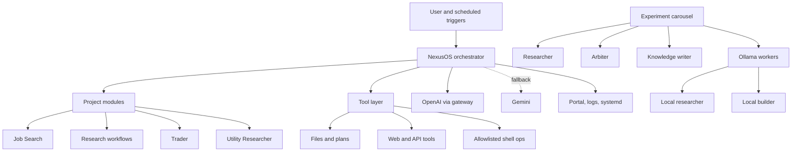

# OpenClaw Public Portfolio Snapshot

OpenClaw is a multi-agent AI system I designed and operate as an always-on service for practical workflows such as research, job search support, task coordination, and trading research. This public snapshot is a clean, shareable repository designed to show how the system is structured, what engineering decisions sit behind it, and what parts of the implementation are representative, without publishing private runtime state or personal data.

## Why This Public Repo Exists

The full working repository contains personal memory files, live operational state, local environment details, and project-specific working artefacts. That makes it a bad candidate for a first public GitHub link.

This snapshot is the safer portfolio version. It is meant to answer five questions quickly:

1. What is OpenClaw?
2. How is it structured?
3. What technical choices does it make?
4. What workflows does it support?
5. What evidence is there that this is a real operated system rather than a toy demo?

## What This Repo Contains

- a concise project overview
- architecture and design documentation
- a summary of major engineering trade-offs
- practical workflow descriptions
- representative code patterns taken from the real system architecture
- public-safe configuration examples

## What Is Intentionally Omitted

- secrets and environment values
- personal profile data and CV content
- live memory files and operational history
- private research artefacts
- deployment-specific host details beyond representative examples

## Architecture



## Repository Layout

```text
openclaw-public/
├── README.md
├── AGENTS.md
├── .gitignore
├── docs/
│   ├── architecture.md
│   ├── decisions.md
│   ├── operations.md
│   ├── use-cases.md
│   └── screenshots/
├── examples/
│   ├── .env.example
│   └── runtime_config.example.json
└── src/
    └── contracts/
        ├── local_workers.py
        ├── project.py
        └── shell_guard.py
```

## Representative Engineering Decisions

- persistent orchestrator instead of one-shot scripts
- mixed model routing across hosted and local models
- project module boundaries instead of one giant agent prompt
- file-backed state for transparency and auditability
- supervised automation with narrow tool boundaries
- lightweight observability over heavyweight infrastructure

More detail:

- [docs/architecture.md](docs/architecture.md)
- [docs/decisions.md](docs/decisions.md)
- [docs/use-cases.md](docs/use-cases.md)
- [docs/operations.md](docs/operations.md)

## Representative Code

This repo includes a few public-safe code files that reflect the real system’s structure:

- [`src/contracts/project.py`](src/contracts/project.py): project interface used to add domain capabilities
- [`src/contracts/local_workers.py`](src/contracts/local_workers.py): local worker pattern with concurrency limits
- [`src/contracts/shell_guard.py`](src/contracts/shell_guard.py): allowlisted shell execution pattern

These are not a full runnable clone of the production repo. They are included to show actual implementation style and engineering judgement in the parts of the system that matter most.

## Screenshots

Add screenshots under [`docs/screenshots/`](docs/screenshots/) when ready. Suggested images:

- `portal-overview.png`
- `job-search-panel.png`
- `telegram-briefing.png`

## Why This Is A Strong Portfolio Repo

This snapshot is designed to be legible to technical hiring managers. It shows architecture, trade-offs, operations, and iteration without making the reviewer wade through personal state or half-finished internal artefacts. The goal is clarity and credibility, not maximum breadth.
