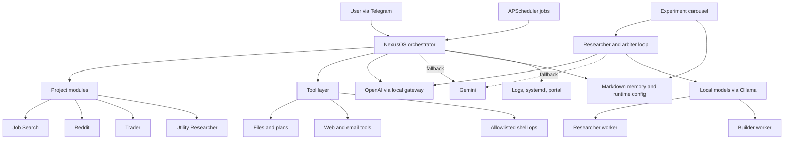

# OpenClaw

OpenClaw is a multi-agent AI platform I designed, built, and operate continuously in production. It orchestrates multiple LLMs across Anthropic, OpenAI, Google, and local models, routes work across providers based on task type and availability, executes tools, and runs background research and automation workflows — all controlled via Telegram.

This is not a demo. It runs 24/7 on cloud infrastructure and is used daily.

## What It Does

| Workflow | What actually happens |
|---|---|
| Job search | Daily scan of live roles, scored against a profile, CV drafts generated and saved |
| Continuous research | Background carousel picks topics from project backlogs, runs research, judges output, writes findings back into project knowledge |
| Trading research | Maintains a watchlist and paper-trades a developing thesis, logging positions and decisions |
| Operational monitoring | Read-only portal shows service health, active projects, model availability, and recent output |
| Scheduled briefings | Morning and evening summaries sent to Telegram using the same orchestration layer as interactive chat |

## Architecture

More detail: [docs/architecture.md](docs/architecture.md)

## Key Engineering Decisions

**Multi-provider routing rather than single-provider lock-in**
OpenAI is the primary path, Gemini is the fallback, and Ollama handles local worker tasks. Different workloads have different latency, cost, and reliability profiles. Hardcoding one provider is a fragility I didn't want.

**Project module architecture rather than one giant prompt**
Each domain (job search, trader, Reddit, utility research) extends a common base interface and registers its own tools. The orchestrator stays generic. Domain logic is isolated and easy to replace.

**Constrained tool access as a design choice, not a limitation**
The shell tool is explicitly allowlisted. File writes are sandboxed to specific directories. External actions require approval before execution. This makes the system trustworthy to operate, not just impressive in a demo.

**Continuous background improvement loop**
The experiment carousel runs independently from user interaction. It selects topics from project backlogs, runs research, sends results to an arbiter model, and writes approved findings back into project knowledge. It can be paused via runtime config without touching code.

**File-backed state over premature database adoption**
Plans, memory, backlog, and research output live in Markdown and small JSON files committed to git. The system's behaviour is transparent, diffable, and easy to inspect during debugging.

More detail: [docs/decisions.md](docs/decisions.md)

## How I Built And Iterated It

The system went through several meaningful changes:

- Started with a single model path. Quota limits and outages forced a multi-provider architecture.
- Background research loops initially ran on the same surface as user interaction. Separating them into a supervised carousel fixed both the responsiveness and the noise problems.
- Core files grew too large. Refactored into project modules with a shared interface, which made the codebase easier to reason about and extend.
- Added runtime config flags so the carousel and project selection could be adjusted without code changes — necessary once the system was running continuously.

The planning notes, refactor audits, and decision logs in `docs/` are part of the actual development process, not retrospective documentation.

More detail: [docs/iterations.md](docs/iterations.md)

## Reliability And Safety

- OpenAI primary, Gemini fallback, with key rotation across a pool to distribute quota
- Local Ollama workers are concurrency-limited with semaphores to avoid OOM on constrained hardware
- The carousel is supervised in `main.py` and restarted automatically after crashes
- Runtime flags in `data/runtime_config.json` allow pausing, tuning, or redirecting the system without restarts
- All outward-facing actions go through explicit approval gates
- The shell tool accepts only an allowlisted set of commands

## Deployment

Always-on service on Oracle Cloud (ARM Linux, 4 OCPUs, 24GB RAM):

- Python application managed by `systemd`
- Ollama and Open WebUI containerised via Docker Compose
- Portal served as a separate systemd service
- No manual intervention required for restarts or crash recovery

## Tech Stack

Python · Docker · Linux/systemd · Oracle Cloud · OpenAI Responses API · Google Gemini · Ollama · python-telegram-bot · Telethon · FastAPI · APScheduler · Git

## Code

**Orchestration and workers**

- [`core/researcher.py`](core/researcher.py) — local model researcher worker: semaphore-limited concurrency, Ollama API, structured error handling
- [`core/carousel_arbiter.py`](core/carousel_arbiter.py) — multi-model judgement layer: OpenAI primary, Gemini fallback with key rotation, structured APPROVE/REFINE/DISCARD output parsing
- [`core/key_pool.py`](core/key_pool.py) — thread-safe Gemini key pool: round-robin rotation, per-key quota tracking, 24h vs transient backoff distinction

**Domain logic**

- [`projects/job_search/scorer.py`](projects/job_search/scorer.py) — heuristic job scorer: weighted signal matching across role, AI, skill, seniority, and location dimensions

**Interfaces**

- [`src/contracts/project.py`](src/contracts/project.py) — base project interface: how domain modules register tools and context with the orchestrator

## Why This Is Relevant For AI-Native Engineering

The work that matters in AI-native engineering is not knowing which model is best — it is building systems that use models reliably, recovering from failures, routing work intelligently, and producing outputs that are actually useful. OpenClaw is evidence of that in practice.

Specifically:

- **Rapid prototyping and deployment** — ideas go from concept to running system, not notebook. Each project module was prototyped, evaluated, and either iterated or discarded based on output quality.
- **Testing and comparing AI tools** — the system runs OpenAI, Gemini, DeepSeek, and Qwen models in parallel roles. I have practical intuition for where each performs well and where it fails.
- **Translating capability into business value** — every module solves a real workflow problem. Job search automation, paper trading research, and utility research are not toy examples.
- **AI governance and boundaries** — approval gates, allowlisted tools, and sandboxed writes are built into the architecture from the start, not added as an afterthought.
- **Operating in production** — the system has been running continuously, failing and recovering, and improving through iteration. That is different from a project that ran once and worked.
