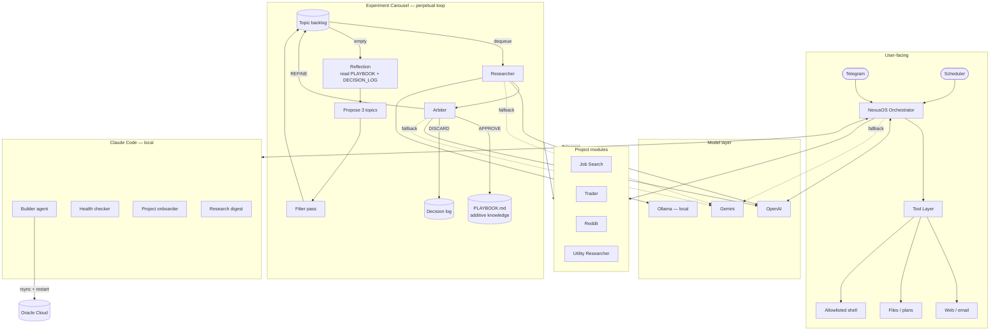

# OpenClaw

OpenClaw is a multi-agent AI platform I designed, built, and operate continuously in production. It orchestrates multiple LLMs across Anthropic, OpenAI, Google, and local models, routes work across providers based on task type and availability, executes tools, and runs background research and automation workflows — all controlled via Telegram.

This is not a demo. It runs 24/7 on cloud infrastructure and is used daily.

## What It Does

OpenClaw combines two things: a conversational orchestrator that responds to messages and executes tasks on demand, and a continuous background research engine that runs independently of any user interaction. Both feed into the same project modules and memory layer.

## The Experiment Carousel

The core of the system is a perpetual research loop — not a cron job or scheduled task, but a `while True` that runs continuously as long as the service is up.

Each cycle pulls a topic from the active project's backlog and processes it through researcher → arbiter. The arbiter returns one of three decisions:

- **APPROVE** — findings are formatted and appended to the project's `PLAYBOOK.md`. The knowledge base is additive: every approved finding builds on what came before.
- **REFINE** — the topic has real promise but the research pass was too shallow. A sharper, more specific version is automatically re-queued.
- **DISCARD** — not worth pursuing. One line logged to the decision log and the loop moves on.

When the backlog runs out of topics, the system doesn't start again blindly. It first runs a **reflection**: reads the full accumulated `PLAYBOOK.md` and `DECISION_LOG.md`, identifies what has already been established, what are confirmed dead ends, and what gaps still remain. A model then proposes 3 new research topics grounded in that reflection. A second model pass filters the proposals before they enter the backlog. Then the loop continues.

The effect is a self-directing research engine: each batch of 3 topics is informed by everything that came before, dead ends don't get re-researched, and the knowledge base compounds over time without manual direction.

The carousel can be paused, redirected to a different project, or have its backlog edited via runtime config — without touching code or restarting the service.

## Projects

Each domain runs as a module that registers its own tools and context with the orchestrator. Current active projects:

| Project | What it does |
|---|---|
| **Job Search** | Scans live roles daily, scores them against a profile, generates tailored CV drafts, tracks applications |
| **Trader** | Researches a developing paper-trading thesis, maintains a watchlist, logs positions and decisions |
| **Reddit** | Researches community engagement strategy for an iOS game, builds a content backlog |
| **Utility Researcher** | General-purpose improvement loop — surfaces friction in workflows and proposes fixes |

## Claude Code Integration

OpenClaw and Claude Code are designed to work as a pair. They communicate through the same Telegram channel, which makes the integration event-driven: OpenClaw sends a message when it needs something built or checked, and Claude Code responds — rather than Claude Code polling a folder on a timer and wasting tokens on empty checks.

Claude Code runs a set of specialised agents, each in its own persistent terminal session:

| Agent | What it does |
|---|---|
| **Builder** | Watches for build jobs queued by OpenClaw. When OpenClaw approves a code change and calls `queue_build_job`, it writes a job file to `plans/build_queue/`. The builder agent picks it up, implements the change, syncs it to the server, and sends a Telegram summary back to Oliver. |
| **Health Checker** | Runs on a cron schedule — 8am daily report to Telegram, evening check. Monitors service status, carousel activity, key pool, memory, and build queue. Auto-fixes known issues silently. |
| **Project Onboarder** | Runs a 5-question interview with Oliver to scaffold a new project — creates all required files, registers the project with the carousel, deploys, and confirms via Telegram. |
| **Research Digest** | Runs Sunday evenings. Reads carousel playbooks and reflections across all projects, synthesises findings, proposes new research directions, and sends Oliver a summary. |
| **CV Writer** | Triggered by OpenClaw's `queue_cv_build` tool. Receives a job description, writes a tailored CV as a Word document, and sends it to Oliver via Telegram. |

The result is a feedback loop between the two systems: OpenClaw handles orchestration, research, and decision-making on the server. Claude Code handles implementation, file operations, and tasks that require a full development environment. Telegram is the message bus between them.

## Architecture

More detail: [docs/architecture.md](docs/architecture.md)

## Key Engineering Decisions

**Why the OpenClaw / Claude Code split exists**
When OpenClaw was first built, using subscription-based frontier models on a 24/7 server wasn't viable — so the system ran on Google's free API tier with key rotation across multiple projects to stay within quota. That constraint is what drove the rotating key pool design. Once OpenAI access became available via a local gateway, it replaced Gemini as the primary orchestration path for better reliability and output quality. Claude Code was kept as the implementation layer because it remains the most capable model for complex code changes — and because it has access to the local filesystem, development tools, and can rsync directly to the server. The split isn't a workaround; it's the right tool for each job.

**Multi-provider routing rather than single-provider lock-in**
OpenAI is the primary path, Gemini is the fallback, and Ollama handles local worker tasks. Different workloads have different latency, cost, and reliability profiles. Hardcoding one provider is a fragility I didn't want.

**Project module architecture rather than one giant prompt**
Each domain (job search, trader, Reddit, utility research) extends a common base interface and registers its own tools. The orchestrator stays generic. Domain logic is isolated and easy to replace.

**Constrained tool access as a design choice, not a limitation**
The shell tool is explicitly allowlisted. File writes are sandboxed to specific directories. External actions require approval before execution. This makes the system trustworthy to operate, not just impressive in a demo.

**Continuous background improvement loop**
The experiment carousel runs independently from user interaction. It selects topics from project backlogs, runs research, sends results to an arbiter model, and writes approved findings back into project knowledge. It can be paused via runtime config without touching code.

**File-backed state over premature database adoption**
Plans, memory, backlog, and research output live in Markdown and small JSON files committed to git. The system's behaviour is transparent, diffable, and easy to inspect during debugging.

More detail: [docs/decisions.md](docs/decisions.md)

## How I Built And Iterated It

The system went through several meaningful changes:

- Started with a single model path. Quota limits and outages forced a multi-provider architecture.
- Background research loops initially ran on the same surface as user interaction. Separating them into a supervised carousel fixed both the responsiveness and the noise problems.
- Core files grew too large. Refactored into project modules with a shared interface, which made the codebase easier to reason about and extend.
- Added runtime config flags so the carousel and project selection could be adjusted without code changes — necessary once the system was running continuously.

The planning notes, refactor audits, and decision logs in `docs/` are part of the actual development process, not retrospective documentation.

More detail: [docs/iterations.md](docs/iterations.md)

## Reliability And Safety

- OpenAI primary, Gemini fallback, with key rotation across a pool to distribute quota
- Local Ollama workers are concurrency-limited with semaphores to avoid OOM on constrained hardware
- The carousel is supervised in `main.py` and restarted automatically after crashes
- Runtime flags in `data/runtime_config.json` allow pausing, tuning, or redirecting the system without restarts
- All outward-facing actions go through explicit approval gates
- The shell tool accepts only an allowlisted set of commands

## Deployment

Always-on service on Oracle Cloud (ARM Linux, 4 OCPUs, 24GB RAM):

- Python application managed by `systemd`
- Ollama and Open WebUI containerised via Docker Compose
- Portal served as a separate systemd service
- No manual intervention required for restarts or crash recovery

## Tech Stack

Python · Docker · Linux/systemd · Oracle Cloud · OpenAI Responses API · Google Gemini · Ollama · python-telegram-bot · Telethon · FastAPI · APScheduler · Git

## Code

**Orchestration and workers**

- [`core/researcher.py`](core/researcher.py) — local model researcher worker: semaphore-limited concurrency, Ollama API, structured error handling
- [`core/carousel_arbiter.py`](core/carousel_arbiter.py) — multi-model judgement layer: OpenAI primary, Gemini fallback with key rotation, structured APPROVE/REFINE/DISCARD output parsing
- [`core/key_pool.py`](core/key_pool.py) — thread-safe Gemini key pool: round-robin rotation, per-key quota tracking, 24h vs transient backoff distinction

**Domain logic**

- [`projects/job_search/scorer.py`](projects/job_search/scorer.py) — heuristic job scorer: weighted signal matching across role, AI, skill, seniority, and location dimensions

**Interfaces**

- [`src/contracts/project.py`](src/contracts/project.py) — base project interface: how domain modules register tools and context with the orchestrator

