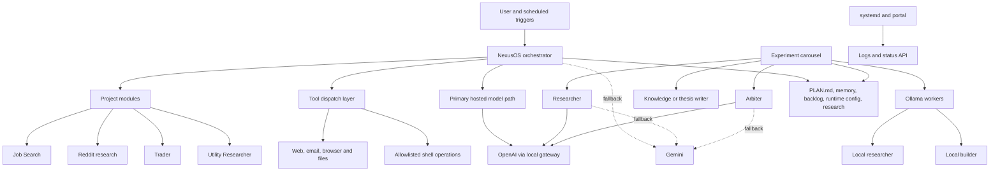

# OpenClaw Architecture

OpenClaw is organised as a persistent orchestration layer plus a set of project modules, workers, tools, and operational services. The design goal is not maximum autonomy. It is useful, supervised automation that can run continuously and recover sensibly when parts of the system fail.

## High-Level View

## Main Components

### Orchestrator

The main runtime entrypoint is [`main.py`](../main.py). It starts:

- the Nexus orchestrator in [`core/nexus.py`](../core/nexus.py)
- the communications agent
- the Telethon bridge
- the Telegram bot
- the scheduler
- the continuous experiment carousel

`NexusOS` is the central agent-facing interface. It loads persistent context from `PLAN.md` and selected memory files, exposes tool definitions, dispatches tool calls, and acts as the main controller for user-facing workflows.

### Agents And Project Modules

OpenClaw uses a project-based structure rather than a single undifferentiated agent. Each project extends [`projects/base.py`](../projects/base.py) and contributes tools and system context.

Current active modules in the repo:

- `projects/utility_researcher/`
- `projects/job_search/`
- `projects/reddit/`
- `projects/trader/`

This keeps the orchestrator generic while allowing each domain to expose its own operations. The job search module is currently the richest example, with job search, scoring, and CV generation workflows.

### Tool Layer

The tool layer sits between the orchestrator and the outside world. It is intentionally narrow.

Examples:

- [`tools/files.py`](../tools/files.py) for file access inside the repo
- [`tools/web.py`](../tools/web.py) for web interactions
- [`tools/email.py`](../tools/email.py) for inbox access
- [`tools/shell.py`](../tools/shell.py) for a small allowlisted set of operational commands

This is one of the main safety boundaries in the system. The shell tool is restricted to a known set of commands, and most workflows rely on repo state and APIs rather than unconstrained command execution.

### Model Provider Abstraction

OpenClaw does not rely on one provider for everything.

Hosted path:

- OpenAI is used through a local gateway in [`core/openai_client.py`](../core/openai_client.py)
- Gemini is used as a fallback path in several orchestration and judgement flows
- Gemini key rotation is handled in [`core/key_pool.py`](../core/key_pool.py)

Local path:

- [`core/researcher.py`](../core/researcher.py) runs a local researcher worker through Ollama
- [`core/builder.py`](../core/builder.py) runs a local builder worker through Ollama
- `docker-compose.yml` provisions Ollama and Open WebUI locally for that layer

The practical result is that the system can use hosted models for orchestration and judgement while still keeping some research and coding work local.

### Memory, State, And Persistence

OpenClaw stores a lot of state as Markdown and small JSON files in the repo. Important locations include:

- `PLAN.md`
- `memory/`
- `research/`
- `plans/`
- `projects/*/experiment_backlog.md`
- `data/runtime_config.json`

This is a deliberate choice. The state is transparent, diffable, and easy to inspect during debugging. It is also easier to present in a portfolio context because the system’s behaviour is visible in plain files rather than hidden in a private database.

There is no broad database-backed memory layer visible in this repo. If there are external stores in deployment, they are not represented here and should be treated as out of scope until confirmed.

### Observability

OpenClaw includes a lightweight operational view rather than a full observability stack.

- systemd service units show how the main runtime and portal are deployed
- the portal backend in [`portal/server.py`](../portal/server.py) exposes service status, active projects, backlog, decision stats, and research output
- logging is used throughout the runtime
- tests exist for selected core behaviour such as carousel rotation and project logic

This is enough to answer a basic operational question: is the system up, what is it doing, and which project loop is active?

### Deployment

The repo includes deployment artefacts for always-on operation:

- [`openclaw.service`](../openclaw.service)
- [`openclaw-portal.service`](../openclaw-portal.service)
- [`openclaw-trader.service`](../openclaw-trader.service)
- [`docker-compose.yml`](../docker-compose.yml)

This points to a cloud-hosted setup where the Python app runs under systemd and Ollama is containerised. The portal is served separately and bound to localhost, which is a sensible default for a read-only internal dashboard.

## Runtime Lifecycle

### 1. Startup

At startup, `main.py` validates configuration, builds the list of projects, initialises `NexusOS`, starts the Telegram-facing components, connects the Telethon client if configured, starts the scheduler, and launches the experiment carousel in the background.

### 2. Interactive Request Handling

For user-driven workflows:

1. The Telegram bot receives a message.
2. Nexus loads its running context and decides whether a tool call is needed.
3. Tools execute within their specific constraints.
4. The result is returned to Nexus and composed into a user-facing reply.

The design keeps the orchestrator in the middle of every step. Project modules extend what can be done, but they do not bypass the core control flow.

### 3. Background Automation

The scheduler in [`bot/scheduler.py`](../bot/scheduler.py) runs recurring tasks such as briefings, audits, daily job search scans, and profile interview prompts. These jobs still route through Nexus, which means scheduled work uses the same orchestration surface as interactive work.

### 4. Continuous Improvement Loop

The carousel in [`core/experiment_loop.py`](../core/experiment_loop.py) cycles through active projects and:

1. reads the relevant backlog
2. selects or generates a topic
3. runs research
4. sends findings to the arbiter
5. either discards, refines, or approves the result
6. writes the approved outcome into project research artefacts

For knowledge-heavy projects, approval tends to produce playbook or thesis updates rather than direct code changes.

## Failure Handling And Fallback Behaviour

OpenClaw is built around graceful degradation rather than assuming every dependency is stable.

- OpenAI is the primary path for some orchestration and arbiter flows.
- If OpenAI fails in those flows, Gemini is used as a fallback.
- Gemini requests rotate across keys and back off differently for quota errors and transient service errors.
- Local Ollama workers catch connection failures and return explicit error messages instead of crashing the whole runtime.
- The main carousel loop is supervised in `main.py` and restarted after crashes.
- Runtime configuration can pause the carousel if a loop becomes noisy or expensive.
- Telethon startup is optional; if not configured, the rest of the system still runs.

## Architectural Trade-Offs

The design is intentionally pragmatic.

- Markdown state is simple and inspectable, but not as structured as a database-backed system.
- Multiple providers improve resilience and flexibility, but increase complexity.
- Local models reduce marginal cost and increase control, but add operational overhead and capacity constraints.
- A project module model scales better than one huge prompt, but still leaves some large core files that would benefit from further refactoring.

That last point matters. The repo shows a real working system, but it also shows the next layer of engineering work still to be done. For portfolio purposes, that is useful evidence of iteration rather than something to hide.
