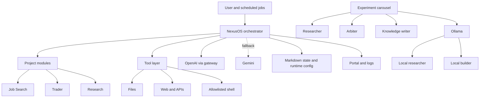

# Architecture

OpenClaw is built around a persistent orchestrator that coordinates multiple project domains, a constrained tool layer, local and hosted model backends, and lightweight operational visibility.

## System Diagram

## Main Layers

### Orchestrator

The orchestrator is responsible for:

- loading persistent context
- exposing and dispatching tools
- coordinating project workflows
- handling user-facing requests
- deciding when to call hosted or local model paths

This is the control plane of the system.

### Project Modules

Each project contributes its own tools and system context through a shared interface. In the real system this keeps job search logic, research workflows, and trading support separate from the orchestration core.

### Tool Layer

The tool layer is intentionally narrow. It provides:

- file access within controlled boundaries
- web and API access
- a small allowlisted set of operational shell commands

This avoids the common failure mode where an agent gets broad tool access before its decision-making is reliable enough to justify it.

### Model Routing

OpenClaw uses a mixed model setup:

- hosted models for orchestration and judgement
- local models through Ollama for worker tasks where cost and control matter
- fallback logic so core workflows can keep operating when one provider path fails

### State And Memory

The real system stores much of its state in Markdown and small JSON files. That choice makes the system easier to inspect, debug, and review in git.

Important patterns in that memory layer:

- a local memory file system for objectives, plans, research, and operating notes
- an append-oriented build log where new implementation decisions are recorded rather than rewritten away
- handover-friendly notes so new or fresh-context agents can pick up work without relying on hidden conversation state

This is less about “memory” in the abstract and more about operational continuity. The system keeps enough written context that a new agent session can recover the current state of play quickly.

### Observability

The operating model is intentionally lightweight:

- service management through systemd
- a read-only portal for status and project summaries
- application logging
- targeted tests for core logic

## Runtime Lifecycle

1. The main service starts and loads configuration.
2. The orchestrator initialises project modules and tools.
3. Persistent memory, objectives, and recent build decisions are loaded so fresh sessions inherit working context.
4. User requests and scheduled jobs are routed through the same orchestration layer.
5. The background carousel processes research backlogs independently of interactive requests.
6. Outputs are written to persistent state and surfaced through logs or the portal.

## Review Cadence

The operating rhythm is part of the architecture, not just a habit around it.

- Sunday review: a weekly synthesis pass over research output to identify trends, promising directions, and dead ends
- `8am` review: a start-of-day checkpoint for small steering changes
- `4pm` review: an end-of-day checkpoint to assess what shifted and what should change next

Those reviews work because the system keeps written state. Without the build log, research notes, and handover files, a fresh agent would have to reconstruct too much from scratch.

## Failure Handling

The real system relies on graceful degradation:

- hosted provider fallback
- key rotation and retry behaviour
- concurrency limits for local workers
- supervised restart for long-running loops
- runtime flags to pause or reconfigure background work

## Why This Matters

The architecture is designed around useful operation, not demo aesthetics. The important qualities are separation of concerns, explicit boundaries, recoverability, and enough observability to trust the system while it runs continuously.
